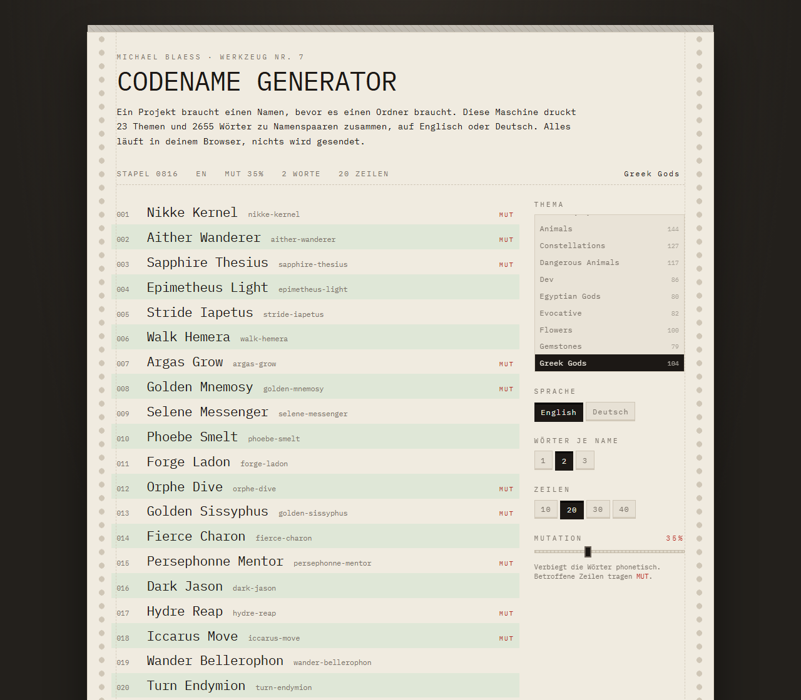

# codename-generator.de

<p align="center">
   <a href="README.md">English</a> ·
   <b>Deutsch</b>
</p>

---

[](https://github.com/michaelblaess/codename-generator.de/actions/workflows/deploy.yml)
[](LICENSE)
[](https://astro.build/)
[](src/data/themes.json)

Das Webgesicht von [codename-generator](https://github.com/michaelblaess/codename-generator),
der Terminal-App. Dieselben Wortlisten, dieselben Regeln, Phosphor-Terminal-Optik. Thema
wählen, einen Stapel Projekt-Codenamen bekommen, mitnehmen was passt. Alles läuft im
Browser - kein Backend, kein Tracking, nichts verlässt die Seite.



## Was die Seite kann

- **24 kuratierte Themen**, 2735 Wörter: griechische/ägyptische/nordische Götter,
  Rennpferde, Whisky, Weine, Berge, Wahrzeichen, historische Schiffe, Swatch-Modelle,
  Tiere, Blumen, Edelsteine, Pilze, Flugsicherung, Dev-Verben und mehr.
- **Englisch und Deutsch.** Deutsch beugt den Modifikator nach dem Genus des Substantivs,
  deshalb steht dort `Stiller Falke`, `Stille Eule`, `Stilles Wiesel` und keine
  Wort-für-Wort-Übersetzung. Themen aus Eigennamen (Götter, Rennpferde, Swatch-Modelle)
  funktionieren in beiden Sprachen.
- **Phonetische Mutation** schiebt ein Wort aus dem Wörterbuch heraus:
  `Pegasus -> Pegasos`. Ein `*` markiert einen mutierten Vorschlag.
- **Eigenes Wort** (Taste `o`): Dein Wort wird mit den Zusätzen der gewählten Sprache
  kombiniert, aus `Sitemap` wird `Obsidian Sitemap` oder `Sitemap Proxy`. Kein Name kommt
  im Stapel doppelt vor. Statt mit Zusätzen lässt sich das Wort auch mit den Wörtern
  eines Themas kombinieren (`Sitemap Selene`, `Pollux Sitemap`), und `VORN`/`HINTEN`
  legen fest, wo es steht. Die Adresse `?word=Sitemap&partner=greek-gods&pos=front`
  öffnet direkt diese Ansicht.
- **Variieren** (Tasten `w` und `m`): `w` hält das Wort des großen Namens und würfelt neue
  Zusätze, `m` hält den Zusatz und wechselt das Wort - aus `Witternder Bär` werden
  `Witternde Feuerwanze` und `Witterndes Damwild`, richtig gebeugt. Aus einer Variante
  heraus geht es weiter, `F1` würfelt neue Varianten, ein Thema in der Liste führt zurück.
- **Merkliste** (Taste `f` merkt, `v` zeigt sie): Gemerkte Namen bleiben im Browser, der
  Mutationsregler wirkt auf sie weiter. Mit `+` setzt du eigene Ideen dazu, `Liste
  kopieren` legt alle Namen untereinander in die Zwischenablage. Das Speicherformat ist das
  der Favoriten in der TUI.
- **Permalinks.** Jeder Stapel hat einen Seed - der Knopf `Link` kopiert eine URL, die
  genau diesen Stapel wieder erzeugt.
- **Zwei Oberflächensprachen.** Deutsch liegt unter `/`, Englisch unter `/en/`, beide aus
  einem Wörterbuch (`src/i18n/ui.ts`). Die Oberflächensprache ist unabhängig von der
  Sprache der erzeugten Namen, die im Bedienfeld umschaltbar bleibt.
- **Rechtsseiten**: Impressum nach § 5 DDG und eine Datenschutzerklärung, die beschreibt,
  was die Seite wirklich tut - keine Cookies, keine Statistik, localStorage nur für die
  Merkliste und erst nach dem ersten Merken. Der Smoketest misst diese Aussagen nach,
  statt ihnen zu glauben.
- **Retro-Effekte** über [retro-text-effects](https://github.com/michaelblaess/retro-text-effects.js),
  mit Rücksicht auf `prefers-reduced-motion`.

## Entwicklung

```
npm install
npm run daten     # Wortlisten aus dem Python-Repo nebenan holen
npm run dev
```

**Änderungen am Inhalt betreffen immer beide Fassungen.** Neue Themen, neue Wörter oder
eine Regeländerung in der Grammatik gehören zuerst ins Python-Repo, danach hier synchronisiert.
`npm run daten:pruefen` macht den Abgleich und schlägt fehl, sobald die JSON-Dateien vom
Python-Stand abweichen - der Wächter gegen "vergessen nachzuziehen".

**Gemeinsame Testvektoren.** Der Kern existiert zweimal, in Python und in TypeScript.
Damit beide gleich rechnen, liegen die Testfälle für alles Deterministische (Slug,
Großschreibung, Beugung, Mutation, Zusammensetzen eines Namens) in
`tests/vectors/core.json` im Python-Repo. `npm run daten` kopiert die Datei nach
`tests/vectors/`, und pytest wie vitest laufen gegen genau diese Datei. Neue Methoden
bekommen zuerst ihre Vektoren, dann die Umsetzung in beiden Sprachen.

`npm run daten` liest die YAML-Dateien aus `../codename-generator` und schreibt
`src/data/*.json`. Das Python-Repo bleibt die einzige Quelle - die JSON-Dateien nie von
Hand bearbeiten. Liegt das Repo woanders, den Pfad mitgeben:

```
npm run daten -- C:/pfad/zu/codename-generator
```

| Befehl | Wirkung |
|---|---|
| `npm run dev` | Entwicklungsserver auf :4321 |
| `npm test` | vitest, übernimmt die Python-Testfälle |
| `npm run build` | statischer Build nach `dist/` |
| `npm run preview` | Build ausliefern |
| `node pruefe-seite.mjs` | Browser-Smoketest gegen die laufende Preview |

Der Smoketest braucht einmalig ein Headless-Chromium:
`PLAYWRIGHT_SKIP_BROWSER_DOWNLOAD=1 npm install --no-save playwright-core`

## Aufbau

```
src/lib/generator.ts   Namensbau, Muster, Themen   (Port von generator.py)
src/lib/grammar.ts     deutsche Flexion            (Port von grammar.py)
src/lib/phonetic.ts    phonetische Mutation        (Port von phonetic.py)
src/lib/rng.ts         seedbarer Zufall (mulberry32)
src/data/*.json        erzeugt, nicht editieren
```

Ein bewusster Unterschied zur Terminal-Fassung: Pythons `random.Random(seed)` lässt sich in
JavaScript nicht nachbauen, derselbe Seed liefert hier also andere Namen als in der TUI.
Innerhalb dieser Seite sind Seeds stabil, und genau das brauchen die Permalinks.

## Gestaltung

Die Optik folgt **Goldrunner** (Atari ST, 1987): schwarzer Grund, Gold, Magenta und
Grün, Copper-Balken an der Oberkante. Die Seite passt in einen Bildschirm - die Listen
rollen in ihren Kästen, die Seite selbst nicht.

Die frühere C64-Fassung mit den Regenbogen-Copper-Balken bleibt als Rückfallebene
erhalten und liegt auf dem Tag `design-c64-copperbars`.

## Auslieferung

Jeder Push auf `main` fährt die Tests, baut und deployt auf GitHub Pages. `public/CNAME`
zeigt auf die Produktivdomain.

## Danksagung

Die Retro-Texteffekte kommen von
[retro-text-effects](https://github.com/michaelblaess/retro-text-effects.js).
Gebaut mit [Astro](https://astro.build/), React und Tailwind.

## Haftungsausschluss

Keine Gewähr. Die erzeugten Namen stammen aus Wortlisten und können mit bestehenden
Produkt-, Projekt- oder Firmennamen zusammenfallen - vor öffentlicher Verwendung prüfen.

## Lizenz

Apache License 2.0 - siehe [LICENSE](LICENSE).
